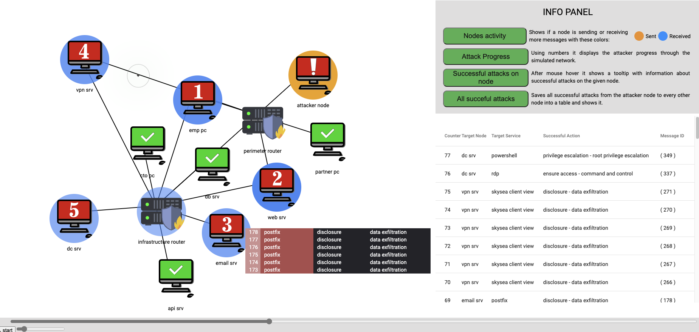

--------------------
User's documentation
--------------------

CYST is a multi-agent discrete-event simulation framework tailored for cybersecurity domain. Its goal is to enable
high-throughput and realistic simulation of cybersecurity interactions in arbitrary infrastructures. The driving force
behind the initial implementation was the need to have an environment for training ML-driven cybersecurity agents; to
have a mean to achieve autonomous cybersecurity.

Autonomous cybersecurity is a distant goal which requires many hurdles to be overcome. CYST aspires to be an important
technology in this regard by providing key functionality, which is not available elsewhere (at least not all in one
package):

    - Lightweight simulation of multi-agent cybersecurity scenarios.
    - Streamlined integration with ML toolkits.
    - Integration of different behavioral models for attackers, defender, users, or observers.
    - Hybrid-stochastic simulation.
    - Rapid prototyping of attack and defense strategies.
    - Integration of simulation and emulation (e.g., IDS in the loop).
    - Smooth transition of agents into the real world.
    - Automated generation of realistic cybersecurity scenarios.
    - Extensible transformation of simulation artifacts into flows, etc.
    - Comprehensive visualization of attack progress.
    - Support for stealth and evasive actions.
    - Support for multi-agent collaboration and communication.

Naturally, as this is a research project, this functionality is in various state of completion. But we are getting
there. CYST is being developed in the context of several research projects:

    - AI-Dojo (https://www.muni.cz/en/research/projects/62788)
    - BEAST (https://www.muni.cz/en/research/projects/49127)
    - C4e (https://c4e.cz/)

        Preview of a visualization of a single simulation run (to be added soon)

First steps
===========

The following section will guide you through setting up the simulation environment and launching your first simulations.

Setting it all up
-----------------

CYST is distributed as a collection of loosely connected python packages. The installation is therefore pretty
straightforward.

    - Requirements: Python 3.9+, pip

.. tabs::

    .. tab:: Windows CMD

        Begin with preparing the environment for your project.

        .. code-block:: console

            ...> mkdir my_awesome_project
            ...> cd my_awesome_project
            ...\my_awesome_project> python -m venv venv
            ...\my_awesome_project> venv\Scripts\activate.bat

        Then install the required CYST packages

        .. code-block:: console

            (venv) ...\my_awesome_project> pip install cyst

    .. tab:: Linux shell

        Begin with preparing the environment for your project.

        .. code-block:: console

            ...$ mkdir my_awesome_project
            ...$ cd my_awesome_project
            .../my_awesome_project$ python -m venv venv
            .../my_awesome_project$ source venv/bin/activate

        Then install the required CYST packages

        .. code-block:: console

            (venv) .../my_awesome_project$ pip install cyst

Running the first do-nothing code
---------------------------------

Now that everything is set up, it's time to run something that does not do anything useful. Create a file in the
my_awesome_project directory and type/copy this code.

    .. code-block:: python
        :linenos:

        from cyst.api.environment.environment import Environment

        e = Environment.create()
        e.control.init()
        e.control.run()
        e.control.commit()

        stats = e.resources.statistics
        print(f"Run id: {stats.run_id}\nStart time real: {stats.start_time_real}\n"
              f"End time real: {stats.end_time_real}\nDuration virtual: {stats.end_time_virtual}")

What this code actually does is that it creates the simulation environment (3), initializes all the configured stuff
(4), runs the simulation, until there is nothing to do (5), confirms that the run finished and data should be saved (6),
gets access to simulation statistics (8), and prints them (9,10).

The entire simulation is managed through the Environment instance that you created at (3). The Environment implements a
couple of interfaces that are used to manage various areas of the simulation. At (4-6) you are using the
:class:`cyst.api.environment.control.EnvironmentControl` interface, which controls the flow of the simulation. The other
interfaces are documented here: :class:`cyst.api.environment.environment.Environment`. But do not spend too much time
reading it, the following text should lead you through them all in a sane manner.

Creating the first simulated machine
------------------------------------

Now that you know how to prepare the simulation, it is time to create a first simulated machine. CYST provides two
approaches to defining the simulated infrastructure - either through declarative description, or imperatively through
configuration interfaces. The latter, however, can get quite wordy, so it is better to use the declarative description
and resort to configuration interfaces for fine-tuning.

In the CYST's simulation model a machine (IT, OT, does not matter) is understood as a collection of services that has
interconnects to the other parts of the infrastructure. In effect, the machines do not have specified operating system,
as this is taken as an artifact of the running services (which is backwards compared to reality, but it makes the model
cleaner without sacrificing expressiveness).

The machine that you will first create will only be running a bash as a representative of the underlying OS. Add this
to your previous code:

        .. code-block:: python
                :linenos:

                from cyst.api.configuration import NodeConfig, PassiveServiceConfig, AccessLevel

                target = NodeConfig(
                    active_services=[],
                    passive_services=[
                        PassiveServiceConfig(
                            type="bash",
                            owner="root",
                            version="8.1.0",
                            access_level=AccessLevel.LIMITED,
                            local=True,
                            id="bash_service"
                        )
                    ],
                    shell="bash_service",
                    interfaces=[],
                    id="target"
                )

                e = Environment.create().configure(target)

Let's unpack it from the inside. The bash service is declared at (6-13) via the
:class:`cyst.api.configuration.host.service.PassiveServiceConfig` object. If you look at the documentation, you will see
that there are much more things to set, but for the start, this is the minimal amount of information you need to provide
to declare a passive service.

A passive service is one type of service that can be present at a machine, the second being an active one. The difference
between these two types is that the passive service exists only as a description and does not, by itself, do any
activity. Every response and every behavior of the service is determined by the environment using the behavioral models
and the service configuration. The upside of this approach is that you can define arbitrary services and do not have to
care about their implementation. All the important (in terms of the simulation model) things are encoded in the service
properties.

So... what properties have you given the bash service with this description?

        - The type of the service is "bash". A passive service can have any type (even of non-existent service).
          However, the importance of the type name is that it is used for evaluation of its exploitability. IOW,
          if you have bash exploit, you can't really use it against bwash service.

        - The owner is set as "root". This affects under which identity will the (pseudo)actions of the passive service
          be evaluated. In case of services, which are designated as shells, this gets a bit more complicated,
          because they take the original actor's identity, but for the most of services this holds.

        - The version is set to "8.1.0". Currently CYST expects everything to conform to semantic versioning, so in
          case of some services that can require twisting the version identifier to conform. The version is
          important for exploitability evaluation.

        - The access level says what kind of access would an attacker have if they gain access to the service, or what
          the service can achieve within the machine. For the list of possible values see
          :class:`cyst.api.logic.access.AccessLevel`.

        - The local parameter specifies, if the service is opened to the network and can be contacted remotely. In case
          of the bash service, it can't be contacted.

        - The id is an optional parameter that can be used when you need to somewhere reference the concrete service.

The rest of the configuration is mostly empty (but required), so the only important bit there is at (15) where the id
of the bash service is set as the shell of the node. By itself the shell does not play an important role, but it is
used for evaluation of specific actions and exploits.

Line (19) extends the previous environment creation by adding the configure() call. It takes any number of configuration
objects and instantiates them within the simulation. In your case, only the target configuration.

You can try and run the simulation, but nothing visible would happen and you would probably only see changes in the
debugger. This will be later added both to the statistics and to the frontend.

Creating a vulnerable service
-----------------------------

At this point, if you are following the tutorial, you have a node with shell configured. While useful in practice, it is
not really an interesting target for the attacker, because there is no vulnerability to abuse. There is no way to get
inside the system. And even if the attacker was inside, there is no trophy awaiting. So let's add some vulnerable
service.

If you checked the API documentation for :class:`cyst.api.host.service.PassiveService`, you may have noticed that there
was nothing about vulnerabilities. The reason is that vulnerabilities are in a way external to the service, tied to
exploits. Therefore, to make a service vulnerable, you only need to create a viable exploit.

But first, let's create a new service. This time remotely accessible, so that there is more going on at the machine.

    .. code-block:: python
        :linenos:

        PassiveServiceConfig(
            type="lighttpd",
            owner="www",
            version="1.4.62",
            access_level=AccessLevel.LIMITED,
            local=False,
            id="web_server"
        )

As before, we will keep the configuration minimal for the time being. If you compare it with bash from the previous
tutorial the differences are rather self-explanatory. The three most important lines for this tutorial are 2, 4, and 6.
The first two define the type and version and will be crucial for exploit preparation, and the third specifies that the
service can be accessed from outside the machine.

For simplicity, let's say that lighttpd version 1.4.62 has a remote code execution vulnerability that got patched in a
next release. That is, a remote attacker can execute an arbitrary code in the context of lighttpd's permissions. The
configuration can look like this:

    .. code-block:: python
        :linenos:

        from cyst.api.configuration import ExploitConfig, VulnerableServiceConfig
        from cyst.api.logic.exploit import ExploitLocality, ExploitCategory

        exploit1 = ExploitConfig(
            services=[
                VulnerableServiceConfig(
                    name="lighttpd",
                    min_version="1.4.62",
                    max_version="1.4.62"
                )
            ],
            locality=ExploitLocality.REMOTE,
            category=ExploitCategory.CODE_EXECUTION,
            id="http_exploit"
        )

Each exploit specifies services, which are affected by it (lines 5-11). The specification is dependent on the service
type and its version. One exploit can work for an arbitrary number of services. Aside from services, the exploit
specifies, if it can be used remotely (line 12) and what effect it does have (line 13). It also enables specification of
additional parameters (see :class:`cyst.api.configuration.logic.exploit.ExploitConfig`), but we leave this out for now
and will return back to it later.

To recap, this is the resulting code, which creates a machine with a specified shell and one vulnerable service.

    .. code-block:: python
        :linenos:

        from cyst.api.environment.environment import Environment
        from cyst.api.configuration import NodeConfig, PassiveServiceConfig, AccessLevel, ExploitConfig, VulnerableServiceConfig
        from cyst.api.logic.exploit import ExploitLocality, ExploitCategory

        target = NodeConfig(
            active_services=[],
            passive_services=[
                PassiveServiceConfig(
                    type="bash",
                    owner="root",
                    version="8.1.0",
                    access_level=AccessLevel.LIMITED,
                    local=True,
                    id="bash_service"
                ),
                PassiveServiceConfig(
                    type="lighttpd",
                    owner="www",
                    version="1.4.62",
                    access_level=AccessLevel.LIMITED,
                    local=False,
                    id="web_server"
                )
            ],
            shell="bash_service",
            interfaces=[],
            id="target"
        )

        exploit1 = ExploitConfig(
            services=[
                VulnerableServiceConfig(
                    name="lighttpd",
                    min_version="1.4.62",
                    max_version="1.4.62"
                )
            ],
            locality=ExploitLocality.REMOTE,
            category=ExploitCategory.CODE_EXECUTION,
            id="http_exploit"
        )

        e = Environment.create().configure(target, exploit1)

As was the case before, you can run the simulation, but nothing will happen yet. But we are getting there!

Networking
----------

The infrastructure created so far exists as a fully isolated machine. So, the remotely exploitable service is still
impenetrable as it sits behind an air gap. In this section we start building a simple network to enable different
machines to communicate between each other.

Networks in CYST are realized through the use of routers. They are a simplified representation of all types of network
active devices. Therefore, you use routers also in place of switches and hubs. Routers enable a rather complex network
configuration, but in this section we will create a simple one, which uses DHCP to assign addresses and lets connected
machines talk to each other without limitation.

For more details see :class:`cyst.api.configuration.network.router.RouterConfig` and
:class:`cyst.api.configuration.network.elements`, or jump to advanced topics in user's documentation.

Here is the router configuration:

    .. code-block:: python
        :linenos:

        from netaddr import IPNetwork, IPAddress
        from cyst.api.configuration import RouterConfig, InterfaceConfig

        router = RouterConfig(
            interfaces=[
              InterfaceConfig(
                ip=IPAddress("192.168.0.1"),
                net=IPNetwork("192.168.0.1/24"),
                index=0
              ),
              InterfaceConfig(
                ip=IPAddress("192.168.0.1"),
                net=IPNetwork("192.168.0.1/24"),
                index=1
              )
            ],
            id="router"
        )

Router operates as a collection of network interfaces with a routing logic on top of them. In this case, you have
created a router with two interfaces - one will connect the target machine and one will connect the attacker.

The interface configurations, as are defined at (6-15), are the same for routers and ordinary machines. In the case of
a router the most important attributes are net and index. The net attribute defines the size of a DHCP pool and also
automatically sets routing within that network. The index represents a "physical location" of the interface and is
needed to correctly establish connections by "putting the cable into the right hole". For machines, when an interface
is explicitly specified, it represents an interface with a static IP address. However, in the case of DHCP, no interface
needs to be configured as this will all happen automagically.

So, now it's time to connect the router and the node.

        .. code-block:: python
                :linenos:

                from cyst.api.configuration import ConnectionConfig

                connection1 = ConnectionConfig(
                        src_id="target",
                        src_port=-1,
                        dst_id="router",
                        dst_port=0
                )

Connections are bi-directional, so it does not really matter who is src and who is dst. If a port is set to -1, first
eligible port is chosen. Connections are expected to support various properties, like jitter, but that is currently not
implemented.

Because the connected machine "target" does not have any interface set, a new one is created and is assigned an IP from
the DHCP pool 192.168.0.1/24. As the strategy is currently sequential, the machine will get an IP 192.168.0.2 and
192.168.0.1 will be set as a gateway.

As usual, these config items need to be included in the configure call.

    .. code-block:: python
        :linenos:

        e = Environment.create().configure(target, exploit1, router, connection1)

Creating and controlling an adversary
-------------------------------------

Now that we have the target ready and connected, it is time to create an adversary that will prey on it. For the
purpose of this exercise, you will use the simplest adversary possible - one that will be fully under your control and
that will just execute pre-defined actions.

The code is similar to the configuration of the target machine:

    .. code-block:: python
        :linenos:

        from cyst.api.configuration import ActiveServiceConfig

        attacker = NodeConfig(
            active_services=[
                ActiveServiceConfig(
                    type="scripted_actor",
                    name="attacker",
                    owner="attacker",
                    access_level=AccessLevel.LIMITED,
                    id="attacker_service"
                )
            ],
            passive_services=[],
            interfaces=[],
            shell="",
            id="attacker"
        )

This configuration will create a new node with one active service of the type "scripted_actor" (line 6). The detailed
description of particular attributes is at :class:`cyst.api.configuration.host.service.ActiveServiceConfig`. However,
other attributes than type are inconsequential in this case.

The other step is to connect the adversary to the same router as the target, so that they can exchange communication.

        .. code-block:: python
                :linenos:

                connection2 = ConnectionConfig(
                        src_id="attacker",
                        src_port=-1,
                        dst_id="router",
                        dst_port=1
                )

The final step is to get access to the control interface of the adversary, so that you can order it to do anything. This
step happens only after the simulation environment is configured, as you need to get this from an instance.

    .. code-block:: python
        :linenos:

        from cyst_services.scripted_actor.main import ScriptedActorControl

        e = Environment.create().configure(target, router, attacker, exploit1, connection1, connection2)

        attacker_service = e.configuration.general.get_object_by_id("attacker_service", Service).active_service
        attacker_control = e.configuration.service.get_service_interface(attacker_service, ScriptedActorControl)

Each active service can define any number of interfaces, which are used for external control of the service. However,
this is for a control by the creator of the environment only and as such is not useful from within the simulation. In
most cases the functions of service interfaces can be replaced by providing configuration parameters to the service. Not
in this case, though. In this tutorial, you as a creator will be in direct control of the simulation.

This approach is a bit cumbersome, but it is expected to be streamlined in future releases. Good news is that this is
the last step before you will finally be able to simulate something.

This is the final code (it could be made much more compact if you want to sacrifice readability):

    .. code-block:: python
        :linenos:

        from netaddr import IPNetwork, IPAddress

        from cyst.api.configuration import NodeConfig, PassiveServiceConfig, AccessLevel, ExploitConfig, VulnerableServiceConfig, \
            ActiveServiceConfig, RouterConfig, InterfaceConfig, ConnectionConfig
        from cyst.api.host.service import Service
        from cyst.api.logic.exploit import ExploitLocality, ExploitCategory
        from cyst.api.environment.environment import Environment

        from cyst_services.scripted_actor.main import ScriptedActorControl

        target = NodeConfig(
            active_services=[],
            passive_services=[
                PassiveServiceConfig(
                    type="bash",
                    owner="root",
                    version="8.1.0",
                    access_level=AccessLevel.LIMITED,
                    local=True,
                    id="bash_service"
                ),
                PassiveServiceConfig(
                    type="lighttpd",
                    owner="www",
                    version="1.4.62",
                    access_level=AccessLevel.LIMITED,
                    local=False,
                    id="web_server"
                )
            ],
            shell="bash_service",
            interfaces=[],
            id="target"
        )

        attacker = NodeConfig(
            active_services=[
                ActiveServiceConfig(
                    type="scripted_actor",
                    name="attacker",
                    owner="attacker",
                    access_level=AccessLevel.LIMITED,
                    id="attacker_service"
                )
            ],
            passive_services=[],
            interfaces=[],
            shell="",
            id="attacker"
        )

        router = RouterConfig(
            interfaces=[
                InterfaceConfig(
                    ip=IPAddress("192.168.0.1"),
                    net=IPNetwork("192.168.0.1/24"),
                    index=0
                ),
                InterfaceConfig(
                    ip=IPAddress("192.168.0.1"),
                    net=IPNetwork("192.168.0.1/24"),
                    index=1
                )
            ],
            id="router"
        )

        exploit1 = ExploitConfig(
            services=[
                VulnerableServiceConfig(
                    name="lighttpd",
                    min_version="1.4.62",
                    max_version="1.4.62"
                )
            ],
            locality=ExploitLocality.REMOTE,
            category=ExploitCategory.CODE_EXECUTION,
            id="http_exploit"
        )

        connection1 = ConnectionConfig(
            src_id="target",
            src_port=-1,
            dst_id="router",
            dst_port=0
        )

        connection2 = ConnectionConfig(
            src_id="attacker",
            src_port=-1,
            dst_id="router",
            dst_port=1
        )

        e = Environment.create().configure(target, attacker, router, exploit1, connection1, connection2)

        attacker_service = e.configuration.general.get_object_by_id("attacker_service", Service).active_service
        attacker_control = e.configuration.service.get_service_interface(attacker_service, ScriptedActorControl)

        e.control.init()
        e.control.run()
        e.control.commit()

Simulating the first interaction
--------------------------------

CYST is a discrete event processor that is built around message passing. That is, actors of the simulation are
interacting through the mechanism of messages. Messages can be understood to comprise of two parts: infrastructure and
logic. The infrastructure part is important for routing and general upkeep of messages. The logic part caries the
intention of actors and responses of recipients. The logic is realized through the concept of behavioral models.
Don't worry, everything will be explained in due time and on concrete examples.

In this example, you will control the attacker to achieve two goals:

    - Probe the network and discover a usable target.
    - Exploit the vulnerability to gain access to the target.

As was written at the beginning of the user's guide, the end goal of CYST is to provide an environment to train
autonomous agents. For that reason, a typical simulation runs without any interference from outside entities and runs
while anything is happening in the simulation or while a goal has not been reached. However, the simulation can be set
to enable outside interference by means of pausing the simulation at certain triggers. In this example, the trigger will
be the attacker receiving a responses to its requests.

This is the code, that should be included before the run() is called.

    .. code-block:: python
        :linenos:

        e.control.add_pause_on_response("attacker.attacker")

The string identifying when to pause is in the form <node_name>.<service_name>.

The next task is to get access to the behavioral model(s) as this provides the adversary with actions to perform. Models
are mostly available through packages, which can be accessed via pip, but the core contains at least a rudimentary
model that contains actions reflecting actionable parts of the CYST API.

Actions in the context of CYST are string descriptions of the form <namespace>:<fragment1>:...:<fragmentN> with some
added parameters. A behavioral model is a collection of such actions with the implementation of action semantics. You
can find more details of behavioral models in developer's documentation. Currently, it should suffice to say that we
will be using the behavioral model (and the actions) of the cyst namespace.

To get the actions from the cyst namespace use this code:

    .. code-block:: python
        :linenos:

        actions = {}
        for action in e.resources.action_store.get_prefixed("cyst"):
            actions[action.id] = action

This will conveniently store all the actions from the cyst namespace into a dictionary for later use, but if you know
which actions to use, then you can query them directly like this (for more details see
:class:`cyst.api.environment.stores`):

    .. code-block:: python
        :linenos:

        action = e.resources.action_store.get("cyst:network:create_session")

This example, however, expects that you have stored them in the dictionary. You can thus list the available actions and
their descriptions:

    .. code-block:: python
        :linenos:

        for action in actions.values():
            print(f"{action.id} ({action.description})")

If you execute the code, you should see an output similar to this one.

    .. code-block:: console

        cyst:test:echo_success (A testing message that returns a SERVICE|SUCCESS)
        cyst:test:echo_failure (A testing message that returns a SERVICE|FAILURE)
        cyst:test:echo_error (A testing message that returns a SERVICE|ERROR)
        cyst:network:create_session (Create a session to a destination service)
        cyst:host:get_services (Get list of services on target node)
        cyst:host:get_remote_services (Get list of services on target node)
        cyst:host:get_local_services (Get list of services on target node)

You will now use one those actions to probe the network. As you can see there is nothing like ping, or SYN scan, or any
other real scanning technique. These are relegated to other behavioral models, e.g., `cyst-models-aif`. In this example,
to keep it as simple as possible, you will abuse the `cyst:test:echo_success` to achieve a similar result, because
you will either get `SERVICE|SUCCESS` if the message reached the target, or `NETWORK|FAILURE` if it can't be routed.

Let's scan the first 16 addresses in the network and see what we get.

    .. code-block:: python
        :linenos:

        action = actions["cyst:test:echo_success"]
        for ip in IPNetwork("192.168.0.1/28").iter_hosts():
            attacker_control.execute_action(str(ip), "", action)
            e.control.run()
            print(f"{ip}: {attacker_control.get_last_response().status}")

The control interface of scripted actor has two functions:

        - execute_action(), which execute one specified action on a target
        - get_last_response(), which returns the last response the actor received

Due to setting the pause trigger on received response, you are enabled to do the processing in the loop: queueing an
action -> unpausing the simulation -> processing the reponse -> queueing an action ... Without the pause trigger, after
the first call to `run()` the simulation would run until it finished. For the implications, see the state diagram of
:class:`cyst.api.environment.control`.

Now, let's go through the code line by line...

        #. An action `cyst:test:echo_success` is stored into variable just for better readability.
        #. All IPs in the /28 (16 addresses) are iterated.

        #. An attacker executes the selected action and directs it at the IP. The empty string is the name of the service
           that the action should target. However, in case of this action the service name is not necessary, because it
           will return SUCCESS if it manages to reach the node.

        #. The environment is ran/unpaused and will run until the attacker gets a response.

        #. The status code of a response is printed together with the IP address the action was targeted at. For the
           status code logic see :class:`cyst.api.environment.message.Status`.

If you run this code, you should receive something like this:

        .. code-block:: console

                192.168.0.1: (NETWORK, FAILURE)
                ...
                192.168.0.2: (SERVICE, SUCCESS)
                ...
                192.168.0.4: (NETWORK, FAILURE)
                ...

There will be some debugging outputs interspersed. You will soon-ish be enabled to turn it off. Nevertheless, you
managed to run your first real simulation. Congratulations!

Now, let's prepare an attack. First, you need to find out what to attack (and for a moment forget that you already know
it because you configured it). Let's assume that you as the attacker know that your IP is 192.168.0.3. The previous
network scanning revealed only one other live IP: 192.168.0.2. The IP 192.168.0.1 is the router and should be alive in
principle, however, routers generally ignore random messages going their way.

    .. code-block:: python
        :linenos:

        action = actions["cyst:host:get_remote_services"]
        attacker_control.execute_action("192.168.0.2", "", action)
        e.control.run()
        print(attacker_control.get_last_response().content)

After you execute this, you should see the list of remotely accessible services:

    .. code-block:: console

        [('lighttpd', VersionInfo(major=1, minor=4, patch=62, prerelease=None, build=None))]

Let's pretend that you are the actual attacker and you don't know anything about the infrastructure and its setup and
weaknesses. How would you find if the service is exploitable?

    .. code-block:: python
        :linenos:

        services = attacker_control.get_last_response().content

        useful_exploits = []
        for service in services:
            service_name = service[0]
            service_version = service[1]
            potential_exploits = e.resources.exploit_store.get_exploit(service=service_name)
            for exp in potential_exploits:
                min_version = exp.services[service[0]].min_version
                max_version = exp.services[service[0]].max_version

                if min_version <= service_version <= max_version:
                    useful_exploits.append((service[0], exp))

        for exploit in useful_exploits:
            service_name = exploit[0]
            actual_exploit = exploit[1]
            print(f"Exploitable service: {service_name}, exploit category: {actual_exploit.category}, exploit locality: {actual_exploit.locality}")

The gist of the code is that you take the services, which are present at the target (1) and look in the exploit store
for eligible exploits (7). Version filtering is currently not implemented, so you have to do it yourself (8-12). As
there may be multiple exploits for one service, you need to store them for later decision (13). The rest of the code
just presents them for your consumption.

In this example there is only one exploit (and conveniently of the right type), so you're going to use it.

  .. code-block:: python
        :linenos:

        action = actions["cyst:compound:session_after_exploit"]
        action.set_exploit(useful_exploits[0][1])
        attacker_control.execute_action("192.168.0.2", useful_exploits[0][0], action)
        e.control.run()

You are going to use one of the compound actions of the cyst namespace. This action is more similar to the actions that
are going to be used in the real world, as it will only allow access to the target machine, if the exploit can be
successfully applied.

At line (2) you have to explicitly bind an exploit to the action. Aside from that, everything is very similar to what
you have already done.

Now comes the last step. Abusing the access to the target.

  .. code-block:: python
        :linenos:

        from cyst.api.network.node import Node

        session = attacker_control.get_last_response().session
        action = e.resources.action_store.get("meta:inspect:node")
        attacker_control.execute_action("192.168.0.2", "", action, session=session)
        e.control.run()

        node: Node = attacker_control.get_last_response().content
        print(f"Services at the target: {node.services.keys()}, interfaces at the target: {node.ips}")

The first important thing happens at line (3). CYST is using the concept of sessions to represent a connection between
services. A session is a network tunnel, which can bypass routing limitations, which would prevent the source and
destination to connect. The way this works is that these tunnels can be chained together, each one being a stepping
stone for the next in line (see :class:`cyst.api.network.session.Session` for details). Both the terminology and the
function is akin to sessions in Metasploit. When you have a session, you have a remote access to a target machine. And
your previous action gave you one.

With the session, you no longer need to rely on remotely executed actions and you can actually start doing stuff
locally at the target. So, the action you use (4) is an action that is from the `meta` namespace. Meta namespace is
a bit different than cyst namespace, as it contains actions to support other actions. Its purpose is to ease the
burden of implementation of behavioral models, by providing some common functionality. That concrete action provides
you with the information about a node you have the access to. To make it easy for later processing, it returns a
read-only node interface (see :class:`cyst.api.network.node`), which you can use to get information about all services
and network interfaces (9). This is also an action you would use with your attacking service to find out information
about the node you are at.

If this was a real or more complicated scenario, you would probably attempt to abuse some local service to get elevated
privileges, steal some data, move to another machine, etc. But it is already getting rather long and complicated, so
this part of the guide ends here and other topics will be covered in other sections.

Here is the complete code:

  .. code-block:: python
        :linenos:

        from netaddr import IPNetwork, IPAddress

        from cyst.api.configuration import NodeConfig, PassiveServiceConfig, AccessLevel, ExploitConfig, VulnerableServiceConfig, \
            ActiveServiceConfig, RouterConfig, InterfaceConfig, ConnectionConfig
        from cyst.api.environment.environment import Environment
        from cyst.api.host.service import Service
        from cyst.api.logic.exploit import ExploitLocality, ExploitCategory
        from cyst.api.network.node import Node

        from cyst_services.scripted_actor.main import ScriptedActorControl

        target = NodeConfig(
            active_services=[],
            passive_services=[
                PassiveServiceConfig(
                    type="bash",
                    owner="root",
                    version="8.1.0",
                    access_level=AccessLevel.LIMITED,
                    local=True,
                    id="bash_service"
                ),
                PassiveServiceConfig(
                    type="lighttpd",
                    owner="www",
                    version="1.4.62",
                    access_level=AccessLevel.LIMITED,
                    local=False,
                    id="web_server"
                )
            ],
            shell="bash_service",
            interfaces=[],
            id="target"
        )

        attacker = NodeConfig(
            active_services=[
                ActiveServiceConfig(
                    type="scripted_actor",
                    name="attacker",
                    owner="attacker",
                    access_level=AccessLevel.LIMITED,
                    id="attacker_service"
                )
            ],
            passive_services=[],
            interfaces=[],
            shell="",
            id="attacker"
        )

        router = RouterConfig(
            interfaces=[
                InterfaceConfig(
                    ip=IPAddress("192.168.0.1"),
                    net=IPNetwork("192.168.0.1/24"),
                    index=0
                ),
                InterfaceConfig(
                    ip=IPAddress("192.168.0.1"),
                    net=IPNetwork("192.168.0.1/24"),
                    index=1
                )
            ],
            id="router"
        )

        exploit1 = ExploitConfig(
            services=[
                VulnerableServiceConfig(
                    name="lighttpd",
                    min_version="1.4.62",
                    max_version="1.4.62"
                )
            ],
            locality=ExploitLocality.REMOTE,
            category=ExploitCategory.CODE_EXECUTION,
            id="http_exploit"
        )

        connection1 = ConnectionConfig(
            src_id="target",
            src_port=-1,
            dst_id="router",
            dst_port=0
        )

        connection2 = ConnectionConfig(
            src_id="attacker",
            src_port=-1,
            dst_id="router",
            dst_port=1
        )

        e = Environment.create().configure(target, attacker, router, exploit1, connection1, connection2)

        attacker_service = e.configuration.general.get_object_by_id("attacker_service", Service).active_service
        attacker_control = e.configuration.service.get_service_interface(attacker_service, ScriptedActorControl)

        e.control.add_pause_on_response("attacker.attacker")
        e.control.init()

        # Store the actions
        actions = {}
        for action in e.resources.action_store.get_prefixed("cyst"):
            actions[action.id] = action

        # Display available actions
        for action in actions.values():
            print(f"{action.id} ({action.description})")

        # Scan the network for usable targets
        action = actions["cyst:test:echo_success"]
        for ip in IPNetwork("192.168.0.1/28").iter_hosts():
            attacker_control.execute_action(str(ip), "", action)
            e.control.run()
            print(f"{ip}: {attacker_control.get_last_response().status}")

        # Look for exploitable services at the target
        action = actions["cyst:host:get_remote_services"]
        attacker_control.execute_action("192.168.0.2", "", action)
        e.control.run()

        services = attacker_control.get_last_response().content

        useful_exploits = []
        for service in services:
            service_name = service[0]
            service_version = service[1]
            potential_exploits = e.resources.exploit_store.get_exploit(service=service_name)
            for exp in potential_exploits:
                min_version = exp.services[service[0]].min_version
                max_version = exp.services[service[0]].max_version

                if min_version <= service_version <= max_version:
                    useful_exploits.append((service[0], exp))

        for exploit in useful_exploits:
            service_name = exploit[0]
            actual_exploit = exploit[1]
            print(f"Exploitable service: {service_name}, exploit category: {actual_exploit.category}, exploit locality: {actual_exploit.locality}")

        # Use the exploit to get access to the target machine
        action = actions["cyst:compound:session_after_exploit"]
        action.set_exploit(useful_exploits[0][1])
        attacker_control.execute_action("192.168.0.2", useful_exploits[0][0], action)
        e.control.run()

        # With the access get information about the target
        session = attacker_control.get_last_response().session
        action = e.resources.action_store.get("meta:inspect:node")
        attacker_control.execute_action("192.168.0.2", "", action, session=session)
        e.control.run()

        node: Node = attacker_control.get_last_response().content
        print(f"Services at the target: {node.services.keys()}, interfaces at the target: {node.ips}")

        e.control.commit()

        stats = e.resources.statistics
        print(f"Run id: {stats.run_id}\nStart time real: {stats.start_time_real}\n"
              f"End time real: {stats.end_time_real}\nDuration virtual: {stats.end_time_virtual}")

Coming up next
--------------
Writing documentation is a tedious and boring process, however, we are working really hard to document as much as
possible in the shortest possible time. Here are some topics, that will be covered soon:

        - Enriching the messages with metadata.
        - Creating a defensive service.
        - Communication between agents.
        - Partitioning the network.
        - Visualizing what's going on.
        - Stuffing everything into a docker.
        - Running GPU-backed parallel simulations.